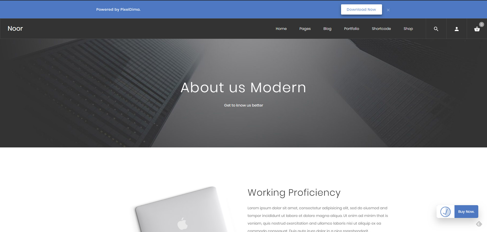
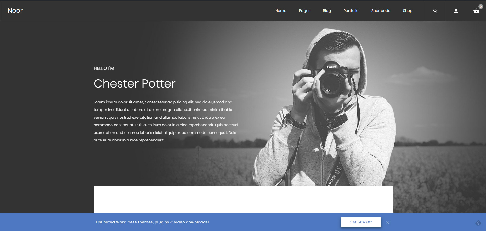
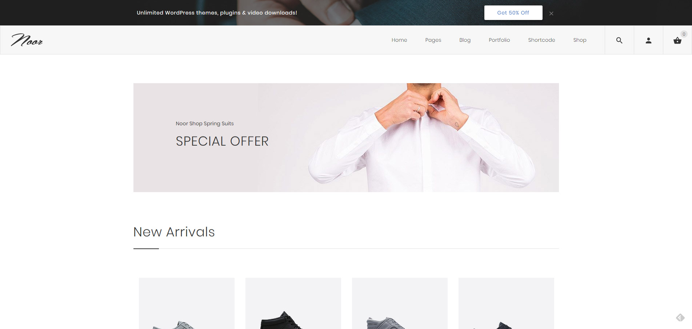
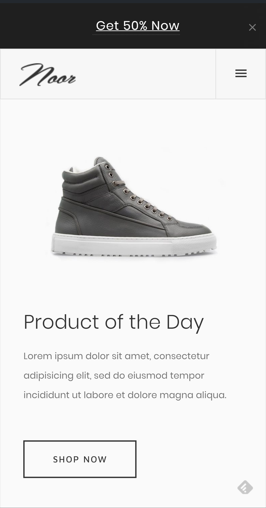
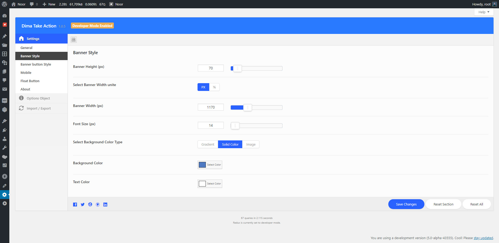

# Dima Take Action
Easily lets you add a Top/Buttom Banner to display a notification and promotion.
**Requires at least:** 4.7  
**Tested up to:** 4.9  
**Stable tag:** 0.7.2  
**License:** [GPLv2 or later](http://www.gnu.org/licenses/gpl-2.0.html)  
**Requires PHP:** 5.3.2  

# Description

Adds a beautiful, customizable take action banner containe a promotion or a news to the top or the bottom of your WordPress site.
Banner that is dismissable and dismiss is saved by cookie.

### Features
* Display a **message** with a **button** (optional).
* Background Image, Gradient color, RGBa Color.
* **Colors** are fully **customizable**.
* **Position** the bar on **top** or **bottom**.
* Set **any height** you want.
* Display a **close button** for the visitor.
* Cookie Bar.
* Floating Button.
* Responsive.

# Installation

1. Click Plugins/Add New from the WordPress admin panel
2. Search for "DIMA Take Action" and install

-or-

1. Download the .zip package
2. Unzip into the subdirectory ‘dima-tke-action‘ within your local WordPress plugins directory
3. Refresh plugin page and activate plugin
4. Configure plugin using settings link under plugin ‘DIMA Take Action‘

## Screenshots
 
### Page Shows Banner at the top and Float Call To Action Button.

### Page Shows Banner at Bottom.

### Page Shows Banner at the top with Background Image.

### Responsive Banner.

### Admin Page.

### Admin Page 2.

## Changelog 
### 1.0.5
* Add: New Option gives the user the ability to open links in a new window.
* Fix small bugs.
### 1.0 
* Initial release